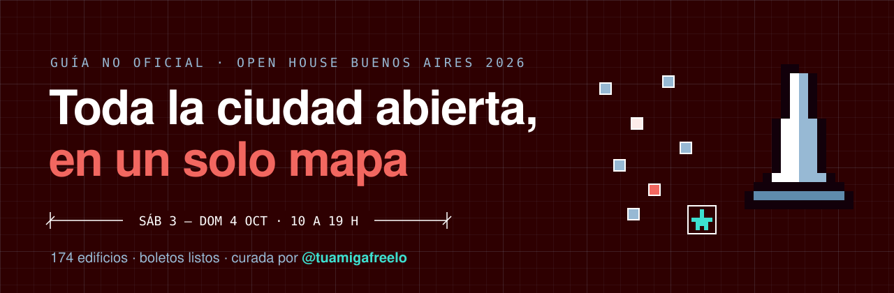

  

  <a href="https://tuamigafreelo.github.io/guia-ohba-2026/"><b>→ Abrir la guía</b></a>
  &nbsp;·&nbsp;
  <a href="https://openhousebsas.org">Web oficial de OHBA</a>
  &nbsp;·&nbsp;
  <a href="https://www.instagram.com/tuamigafreelo">@tuamigafreelo</a>

  
  
  
  

---

## ¿Qué es esto?

Una guía **gratis y no oficial** para recorrer [Open House Buenos Aires](https://openhousebsas.org) el sábado 3 y el domingo 4 de octubre de 2026. Está pensada para usar desde el celu, en la calle.

Si es tu primera vez y te abruma armar el itinerario: **elegí un boleto** y listo.

## Qué podés hacer

| | |
|---|---|
| 🗺️ **Mapa** | Los 174 edificios en un mapa de la ciudad, con colores según cómo se entra. |
| 🎟️ **Boletos listos** | Tres recorridos armados para hacer a pie, con versión sábado y domingo. |
| ★ **Gaby's picks** | Mi curaduría: casas y edificios que solo se pueden visitar en Open House. |
| 🔎 **Filtros** | Por día, turno (mañana o tarde), barrio, entrada libre y accesibilidad. |
| 📋 **Tu recorrido** | Marcá favoritos y la guía los ordena por turno y cercanía. Tachá lo que ya visitaste. |
| 💬 **Mandáselo a tu grupo** | Copiás tu recorrido y lo pegás en WhatsApp, con horarios y direcciones. |

## Los boletos

| Boleto | Para quién | Sábado | Domingo |
|---|---|:---:|:---:|
| **Centro de película** | Ateliers de los años 30, rascacielos y bancos por dentro | 8 paradas | 7 paradas |
| **Villa Crespo creativo** | Talleres, estudios y casas a pocas cuadras | 8 paradas | 7 paradas |
| **Así vive la gente** | PH, casas y edificios chicos para chusmear cómo vive el otro | 8 paradas | 7 paradas |

> Mi regla: priorizo las casas y los edificios institucionales difíciles de visitar. Igual, cada año cambia lo que abre, así que no hay una guía 100% definida: lo mejor es ir y mandarte a lo que te pinte, porque todo está bueno.

## Antes de ir

- **Es gratis.** Hay dos turnos: mañana de 10 a 14 y tarde de 15 a 19. El último ingreso es 30 a 40 minutos antes del cierre.
- **Los edificios con inscripción ya están agotados.** En la guía figuran así. Si no sacaste entrada, este año ya fue: anotátelos para el próximo.
- **Llevá DNI**, SUBE cargada, agua y zapatillas cómodas.
- **Chequeá la ficha oficial** de cada edificio antes de salir, por si cambió algo.

## ⚠️ Aviso

Esta guía **no está hecha ni avalada por Open House Buenos Aires.** Los datos se tomaron de su web pública el 23/9/2026 y pueden cambiar. Las inscripciones y la información oficial están solo en [openhousebsas.org](https://openhousebsas.org).

## Créditos

- **Datos de los edificios:** [Open House Buenos Aires](https://openhousebsas.org/catalogo/)
- **Fotos:** cada foto está enlazada directo desde la web de Open House BA (no hay copias en este repo) y lleva el crédito de su fotógrafo, tal como figura en la ficha oficial
- **Mapa:** © [OpenStreetMap](https://www.openstreetmap.org/copyright) · © [CARTO](https://carto.com/attributions)
- **Tipografías:** Archivo e IBM Plex Mono, de Google Fonts

Hecha con un solo archivo HTML, sin build. Todo lo que marcás se guarda en tu navegador: nadie más lo ve.

## Gracias, Open House 💛

Esta guía existe gracias a Open House Buenos Aires, que cada año abre la ciudad gratis junto a organizadores, voluntarios, arquitectos y dueños que te dejan pasar. Si te sirvió, apoyalos: [sumate como voluntario/a](https://openhousebsas.org/voluntariado), [comprá su libro](https://openhousebuenosaires.mitiendanube.com/) o [seguilos en @openhousebsas](https://www.instagram.com/openhousebsas).

---

  <b>¡Prepará tu itinerario y tus ganas de conocer la ciudad!</b> 
  Con amor, Gaby · <a href="https://www.instagram.com/tuamigafreelo">Tu Amiga Freelo</a>

